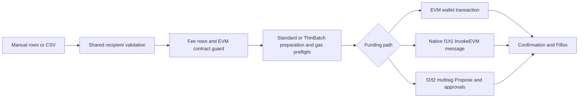

# SendFIL

[](https://github.com/sendfil-io/sendfil/actions/workflows/ci.yml)

<p align="center">
  
</p>

SendFIL is a client-only batch payment app for sending FIL to one or many Filecoin addresses. It supports EVM/FEVM wallets, native `f1`/`t1` accounts through FilSnap and Ledger Filecoin, and native `f2`/`t2` multisig funding controlled by a connected `f1`/`t1` signer.

There is no SendFIL application backend or server-side database. The browser prepares and reviews each batch, the connected wallet authorizes it, and network reads and submission use the wallet provider plus configured FEVM or Lotus-style RPCs.

**Live app:** [sendfil.io](https://sendfil.io/)

> [!IMPORTANT]
> Mainnet and Calibration are first-class code paths with automated unit and component coverage. The review/send flow also has a Mainnet-default mock-E2E lane. Real public-network and wallet/provider smoke verification is still incomplete; see [Production readiness](#production-readiness).

## Current supported surface

| Area | Current implementation |
| --- | --- |
| Networks | Filecoin Mainnet (`314`) and Calibration (`314159`) |
| EVM wallets | MetaMask, Brave Wallet, and WalletConnect through RainbowKit/wagmi |
| Native wallets | FilSnap through MetaMask Snap and Ledger Filecoin through WebHID |
| Single-signer funding | A connected EVM `0x` account, or a native Filecoin `f1`/`t1` account |
| Multisig funding | A native `f2`/`t2` actor controlled by a connected native `f1`/`t1` signer |
| Recipients | Mainnet `f1`, `f2`, `f3`, `f4`, and `0x`; Calibration `t1`, `t2`, `t3`, `t4`, and `0x` |
| Batch input | Manual rows or CSV upload, with a downloadable template |
| Execution methods | Standard (Atomic only) or ThinBatch (Atomic or refund-safe Partial) |
| Status | Review, signing, pending, confirmed, failed, and native uncertain/recovery states with Filfox links |

Network changes are explicit user actions. Unsupported EVM chains remain connected but cannot review or send. Native wallet connections start on the configured default network and can be explicitly switched between Mainnet and Calibration through the wallet UI.

## Design



The same selected Standard or ThinBatch payload is used for review-time estimation and submission. Only the outer authorization and wire format change by funding path.

### Funding paths

| Funding path | Connected signer | On-chain submission |
| --- | --- | --- |
| EVM/FEVM single signer | MetaMask, Brave, or WalletConnect `0x` account | One FEVM transaction to the selected batch contract |
| Native single signer | FilSnap or Ledger `f1`/`t1` account | One native Filecoin `InvokeEVM` message carrying the prepared FEVM batch |
| Native multisig | FilSnap or Ledger `f1`/`t1` signer controlling an `f2`/`t2` actor | One native multisig `Propose`; the actor attempts the batch at threshold, or the proposal waits for more approvals |

Single-signer batches require one wallet approval. A multisig proposal records the connected signer's approval, but higher-threshold actors require additional signers to approve before the actor attempts the inner batch.

The live multisig UI can:

- import or create network-scoped `f2`/`t2` actors;
- display actor balance, available balance, signers, threshold, and pending proposals;
- propose the currently reviewed Standard or ThinBatch payload;
- decode and display every payment in a compatible pending proposal before approval;
- approve compatible proposals and cancel eligible proposals; and
- distinguish a queued proposal, successful threshold execution, and inner actor failure.

Saved multisig metadata is network-scoped in browser localStorage. It is not stored by a SendFIL backend.

### Execution methods

| Method | Error modes | Routing and behavior |
| --- | --- | --- |
| **Standard** (default) | Atomic only | Calls `Multicall3.aggregate3Value(...)` with `allowFailure=false`. `0x` and `f4`/`t4` destinations receive direct EVM value calls; native Filecoin destinations route through `FilForwarder`. Any failed payment reverts the full batch. |
| **ThinBatch** | Partial or Atomic | Calls `ThinBatchPayer.payBatch(...)`. Partial mode records per-payment results and refunds failed-payment value to the caller; Atomic mode reverts the full batch on any failure. A failed refund reverts the transaction. |

Standard Partial is deliberately disabled. A failed value-bearing `aggregate3Value(...)` subcall cannot safely refund its value, so best-effort delivery is available only through ThinBatch.

Mainnet and Calibration ThinBatch addresses are built-in defaults and can be overridden with environment variables. Their presence in configuration is not proof of current deployment health; public-network smoke verification is tracked separately.

## Recipient and CSV rules

Manual entry and CSV upload share one validation pipeline.

- `f1`/`t1`, `f2`/`t2`, and `f3`/`t3` recipients use native Filecoin routing.
- `0x` and `f4`/`t4` are equivalent EVM destinations and use direct EVM value transfers.
- `f2`/`t2` actor recipients receive a simple FIL value transfer; SendFIL does not invoke an actor method.
- `f0`/`t0` ID addresses are rejected.
- Native address prefixes must match the connected network.
- Amounts must be positive FIL values with no more than 18 decimal places.
- Duplicate destinations, including `0x` and `f4`/`t4` twins, require explicit acknowledgment in Review.
- EVM destinations with deployed bytecode are blocked; the current product supports EOA-like `0x` and `f4`/`t4` recipients only.

CSV columns are case-insensitive and may appear in any order:

| Field | Accepted headers |
| --- | --- |
| Recipient | `receiverAddress`, `receiver_address`, `address`, `to` |
| FIL amount | `value`, `amount`, `fil`, `tokens` |

Empty rows are ignored. The current limits are:

- Standard: up to 500 user-entered recipients, plus any configured fee rows.
- ThinBatch with fees disabled: up to 500 user-entered recipients.
- ThinBatch with fees enabled: up to 498 user-entered recipients, reserving two of the contract's 500 payment slots for fee rows.

The repository template is [public/sendfil-template.csv](public/sendfil-template.csv).

## Safety model

The live review/send flow applies these guardrails:

- Review estimation and submission use the same recipients, execution method, error mode, network, and fee rows.
- An unsupported wallet network blocks Review and Send; SendFIL does not silently switch the wallet's network. Wrong-prefix recipient rows can be reviewed with their errors visible, but they block estimation and Send.
- Every final `0x` and `f4`/`t4` payment, including appended fee rows, is checked with `eth_getCode` before review estimation and again before submit. The check fails closed if recipient code cannot be verified.
- Invalid rows block Send. Duplicate rows warn and require explicit review acknowledgment.
- EVM and native single-signer balances are re-read after submit-time gas estimation. Multisig proposals separately recheck actor spendable balance for the batch and connected-signer balance for proposal gas.
- Pending multisig approvals are enabled only after the nested CBOR and ABI payload is decoded and revalidated against payment totals, execution mode, fee policy, duplicate policy, and contract-recipient policy.
- Submitted transactions and native messages use network-correct Filfox links.

### Native submission recovery

For native batches and multisig actions, an RPC timeout does not prove that a signed Filecoin message was rejected. SendFIL therefore:

- derives the exact signed-message CID locally before `Filecoin.MpoolPush`;
- writes an exact-CID recovery record before submission;
- serializes native signing through an origin-wide Web Lock;
- blocks another native signature while a prior outcome is unresolved; and
- rechecks the same CID instead of automatically signing the operation again.

Native signing fails closed when Web Locks or required browser storage are unavailable. Recovery records are local to the current browser origin and do not sync across browsers or devices. Do not clear site data while a native action is unresolved; retain and inspect the recorded CID.

## Fees

Fees are network-configured and shown separately in Review.

- The repository default enables a 1% Mainnet platform fee, split between two configured recipients.
- Calibration fees are disabled by default.
- An enabled fee policy requires two valid same-network recipient addresses; missing, invalid, or recipient-conflicting settings block estimation and Send while Review displays the error.
- Fee shares are truncated to microFIL precision, appended as payment rows, and included in value totals, balance checks, contract-recipient checks, and multisig proposal verification.

Deployments can override the percentage, split, recipients, and enabled state through environment variables.

## Local development

### Prerequisites

- Node.js `>=22 <23`
- Yarn `1.22.22`

### Setup

```sh
corepack enable
cp .env.example .env.local
yarn install --frozen-lockfile
yarn dev
```

Set `VITE_WALLETCONNECT_PROJECT_ID` to a valid WalletConnect project ID.

Most FEVM/Lotus RPC, explorer, Multicall3, FilForwarder, and ThinBatch settings have repository defaults and can be overridden in `.env.local`. See [.env.example](.env.example) for deployment defaults and override names. All `VITE_*` values are bundled into the browser; never put secrets in them.

> [!WARNING]
> Mainnet fees are enabled by default. Replace the placeholder `VITE_FEE_ADDR_A_MAINNET` and `VITE_FEE_ADDR_B_MAINNET` values with valid Mainnet recipients, or explicitly disable Mainnet fees for local development. Invalid enabled fee settings intentionally block estimation and Send while Review displays the error.

Useful optional settings include:

- `VITE_DEFAULT_NETWORK=calibration` to default native wallet connections to Calibration;
- `VITE_NATIVE_FILECOIN_WALLET_ENABLED=false` to hide FilSnap and Ledger; and
- `VITE_LOTUS_RPC_STATE_READ_FALLBACK_*` for an independent read-only fallback, which is never used for `MpoolPush`.

For native wallets, FilSnap requires MetaMask with FilSnap installed or enabled. Ledger requires a desktop Chromium browser with WebHID support, an unlocked device, and the Filecoin app open.

## Validation

Run the default merge-gate checks:

```sh
yarn ci:verify
```

Run the Playwright review/send smoke lane:

```sh
yarn playwright install chromium
yarn test:e2e:smoke
```

Use `yarn ci:all` to run both groups. The Playwright lane uses a deterministic Mainnet-default mock wallet and adapter, skips live gas estimation, and does not send a public-network transaction. It verifies the application flow, not real wallet/provider compatibility or deployed contract health.

See [docs/ci.md](docs/ci.md) for the test-lane and merge policy.

## Browser-local telemetry

The EVM/FEVM and native single-signer batch hooks emit structured events locally through:

- `console.info('[sendfil:batch-telemetry]', payload)`; and
- a `window` custom event named `sendfil:batch-telemetry`.

The repository does not forward these events to an analytics backend. Multisig proposal, create, approve, and cancel actions do not currently use this emitter.

## Repository map

| Path | Purpose |
| --- | --- |
| `src/App.tsx` | Live UI orchestration, validation, review, and funding-path selection |
| `src/lib/transaction/` | Standard/ThinBatch preparation and EVM/native single-signer execution |
| `src/lib/senders/` | Connected-sender model, FilSnap/Ledger adapters, and native submission recovery |
| `src/lib/multisig/` | Native multisig actor reads, create/import lifecycle, proposal encoding, verification, and actions |
| `src/lib/networks.ts` | Mainnet/Calibration registry, contracts, RPCs, explorers, and fee policy |
| `src/utils/recipientValidation.ts` | Shared manual/CSV address, amount, limit, and duplicate validation |
| `src/utils/contractRecipientGuard.ts` | App-level EVM contract-recipient guard |
| `contracts/ThinBatchPayer.sol` | Permissionless ThinBatch payment contract source |
| `docs/invariants.md` | Current safety invariants and implementation status |

The legacy native one-message-per-recipient helpers in `messageBuilder.ts`/`executor.ts` and the E2E `mockAdapter.ts` are not the production UI send path.

## Production readiness

Implemented in code does not mean every network/wallet combination has been verified against a public chain. Current limitations include:

- Mainnet and Calibration FEVM, ThinBatch, FilSnap, Ledger, and native multisig flows still need broader real-wallet/public-network smoke coverage.
- Built-in ThinBatch addresses are not verified by repository CI, and this repo does not contain repeatable Solidity compile/deployment tooling.
- Native Filecoin providers use adapter-default account derivation; account/index selection is not implemented.
- Native safety/recovery requires browser localStorage and Web Locks, and its records do not roam across browsers or devices.
- Contract-recipient blocking is an RPC-dependent frontend guard, not an on-chain restriction in the lower-level builders or ThinBatch contract.
- Validation accepts up to 18 decimal places, but the live recipient pipeline still converts accepted amount strings to JavaScript `Number` before fee calculation and execution. Exact end-to-end 18-decimal preservation remains a money-safety hardening task.
- The main UI does not yet include a centralized-exchange `0x` warning, past-transaction history, or stuck-transaction guidance.

## Engineering docs

- [docs/invariants.md](docs/invariants.md) — durable live-path safety rules and test references
- [docs/atomic-error-handling.md](docs/atomic-error-handling.md) — Standard/ThinBatch error semantics and telemetry
- [docs/ci.md](docs/ci.md) — test lanes and merge policy

## License

SendFIL is dual-licensed under either the MIT License or the Apache License, Version 2.0, at your option. See [LICENSE-MIT](LICENSE-MIT) and [LICENSE-APACHE](LICENSE-APACHE).
